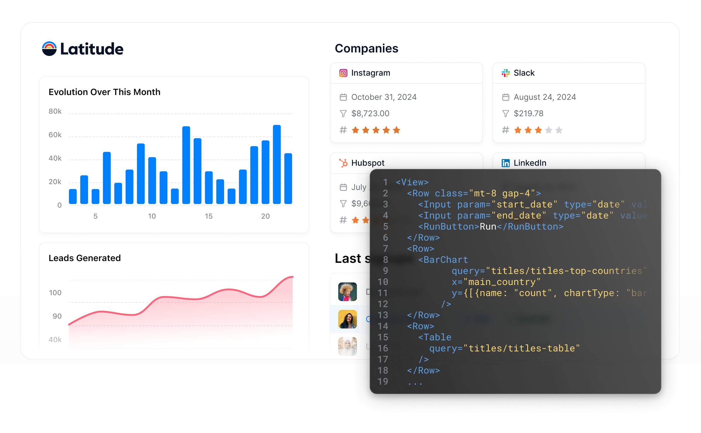

# Latitude Framework

Latitude is an open source full-stack framework to build interactive data apps on top of your data using code.

Write composable SQL queries with custom parameters to pull and transform your data, and use simple frontend components to display it in a rich and interactive application.

Check out the [live demo](https://netflix-sample.fly.dev/)

## Use cases

You can use Latitude for many things, but the most common use cases are:

- **Data apps**: Build interactive frontend applications on top of your data.
- **Embedded analytics**: Add data visualizations and dashboards to your existing app.

## Documentation

Visit the [public docs](https://docs.latitude.so/) to view the full documentation.

## Prerequisites

You need to have [NodeJS >18.x](https://nodejs.org/en) installed in your
machine.

## Quick start

Here’s a quick getting started guide to get the sample app up and running:

### 1. Install Latitude

Run the following command to install the Latitude CLI globally on your machine:

`npm install -g @latitude-data/cli`

### 2. Create the starter project

Run this command to create a new Latitude project:

`latitude start`

The CLI will ask you the project name. Once you’re done, you’ll have a new
directory with a sample app that you can run and customize.

### 3. Navigate to the project and run the app

`cd my-new-app`

`latitude dev`

This will start the development server and open the sample app in your browser.

## Install CLI

To use the Latitude CLI, you need to have Node.js installed on your machine.
You can download it from the [official website](https://nodejs.org/en).

Run the following command to install the Latitude CLI globally:

`npm install -g @latitude-data/cli`

## Community

The Latitude community can be found on
[Slack](https://trylatitude.slack.com/join/shared_invite/zt-17dyj4elt-rwM~h2OorAA3NtgmibhnLA#/shared-invite/email)
where you can ask questions, voice ideas, and share your projects with other
people.

## Contributing

Contributions to Latitude are welcome and highly appreciated.

If you are interested in contributing, please join us on our [Slack
community](https://trylatitude.slack.com/join/shared_invite/zt-17dyj4elt-rwM~h2OorAA3NtgmibhnLA#/shared-invite/email),
open an [issue](https://github.com/evidence-dev/evidence/issues/new), or
contribute a pull request.

### Release

We use [changesets](https://github.com/changesets/changesets) for doing our
releases. This package has 2 commands very handy.

1. `pnpm changeset add`. It will ask what packages you want to publish and what
   SEMVER version you want to pump. `MAYOR` `MINOR` or `PATCH`. When you pick
   what you want it will write a file with a random file in
   `./changsets/ramdom-name.md`. You can read [more about it here](https://github.com/changesets/changesets/blob/main/docs/detailed-explanation.md)
2. If you do point (1) you can push the code to GitHub. Nothing will happen. Is
   when you do `pnpm changeset version` that all the files in `.changesets/...`
   are collected, the version on the packages in those files are bumped and a
   release is prepared.
3. Once a release is prepared you can publish with this command: `pnpm publish --recursive --access public`

**NOTE** This release documentation is temporal we need to fully understand the
release cycle. We need to include for example `TAGS` for grouping things. Or
automate the release cycle. Changesets docs are full of great info.

## Contact

If you want to share ideas or have questions, [say
hello](https://www.notion.so/4086e35ef7c14a6da14c1c9ce1c6be32?pvs=21).
